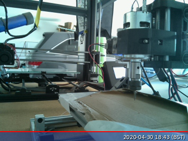

# factory-server

application hub for my internet factory

Please see [my blog post](https://medium.com/@jacobfv123/building-my-internet-factory-availability-accessibility-reliability-bba924a3b2f0) for the journey